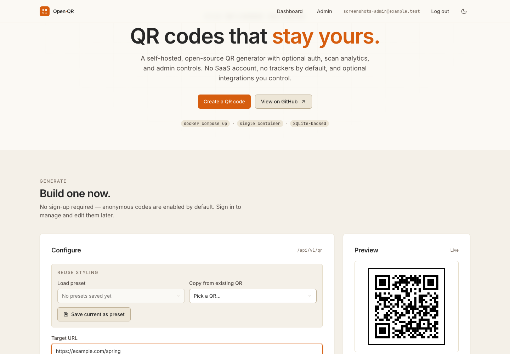
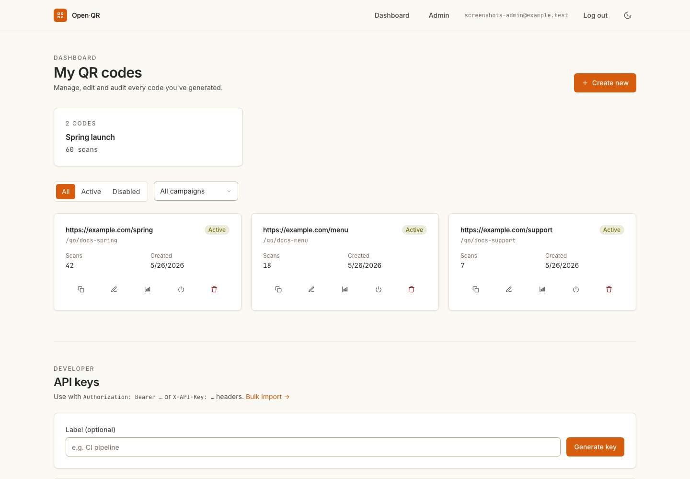
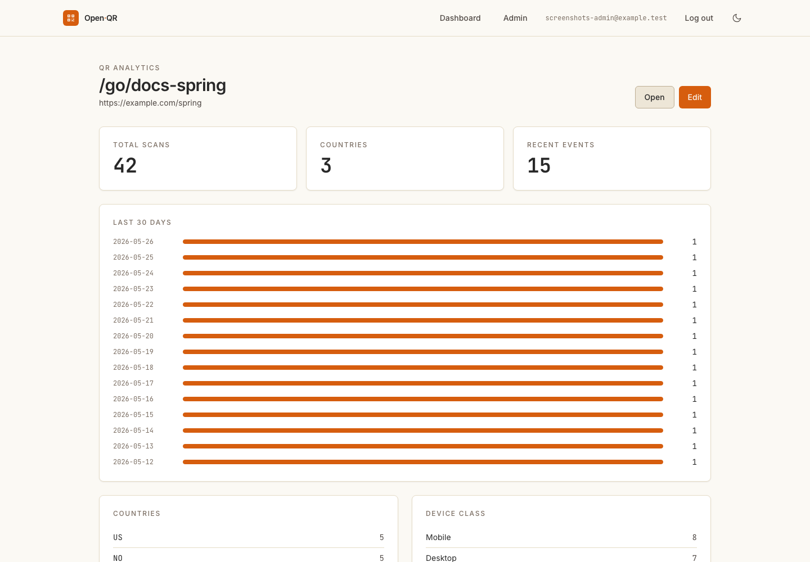
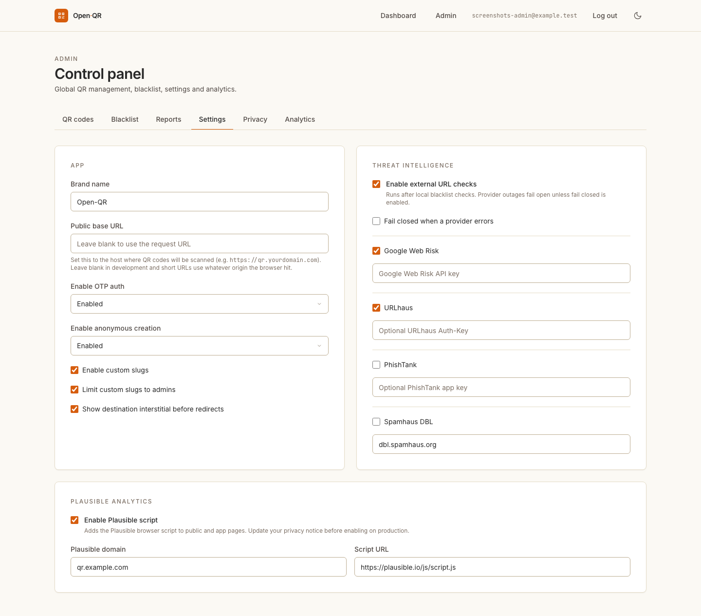
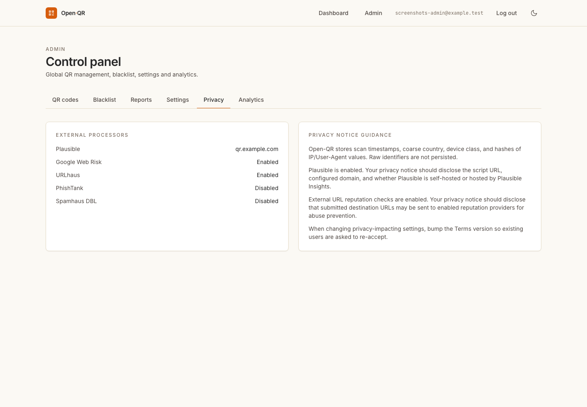
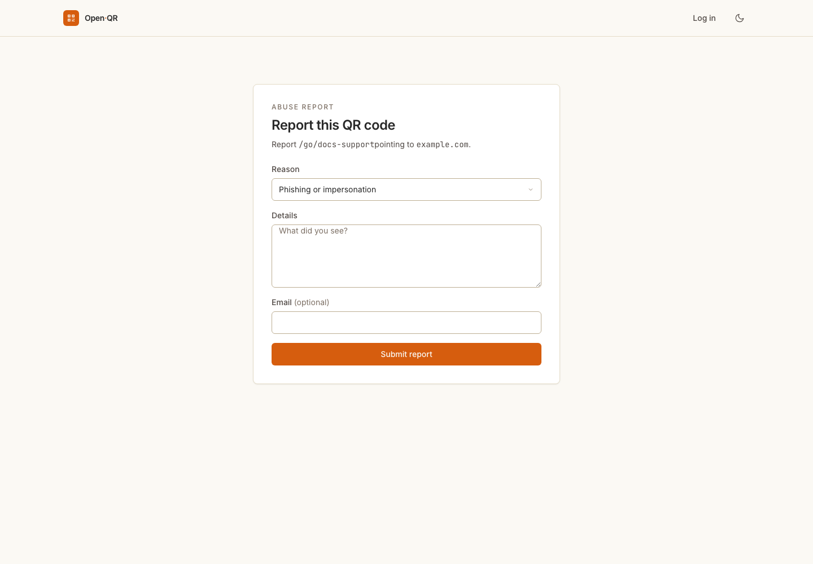
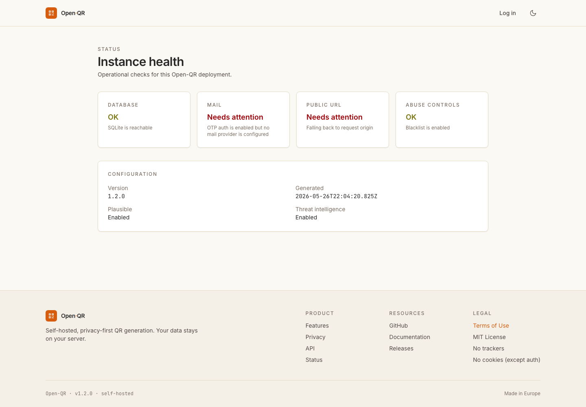
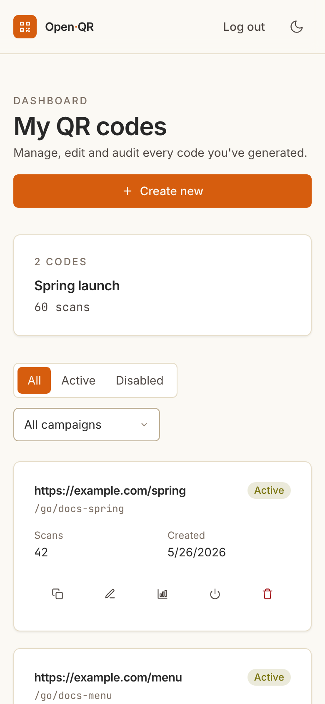

# Open-QR

A self-hosted, open-source QR code generator with optional OTP authentication, advanced styling, scan analytics, and admin management. Deploy it anywhere as a single Docker container.

**Try it live: [openqr.xyz](https://openqr.xyz)** — the maintainer-run reference instance, free to use under its [Terms of Use](https://openqr.xyz/terms).

[](https://opensource.org/licenses/MIT) [](CHANGELOG.md)

---

## Table of Contents

- [Features](#features)
- [Screenshots](#screenshots)
- [Documentation](#documentation)
- [Architecture](#architecture)
- [Quick Start](#quick-start)
  - [Docker Compose (Recommended)](#docker-compose-recommended)
  - [Manual Installation](#manual-installation)
- [Configuration](#configuration)
  - [Environment Variables](#environment-variables)
  - [Authentication Modes](#authentication-modes)
  - [SMTP Setup](#smtp-setup)
- [Usage](#usage)
  - [Generating QR Codes](#generating-qr-codes)
  - [Managing QR Codes](#managing-qr-codes)
  - [Admin Panel](#admin-panel)
- [API Documentation](#api-documentation)
  - [Authentication](#authentication)
  - [QR Codes](#qr-codes)
  - [Admin](#admin)
  - [Health](#health)
- [Development](#development)
  - [Project Structure](#project-structure)
  - [Database](#database)
  - [Running Tests](#running-tests)
- [Deployment](#deployment)
- [Security](#security)
- [Privacy](#privacy)
- [Roadmap](#roadmap)
- [Contributing](#contributing)
- [License](#license)

---

## Features

### QR Code Generation
- **Custom styling**: Choose foreground/background colors, border size and style (solid, dashed, dotted)
- **Templates**: Default, minimal, colorful, rounded, dark themes
- **Center overlay**: Add text (up to 10 characters) or an image to the center of the QR code
- **Error correction**: 4 levels (L/M/Q/H) for different damage tolerance
- **Output formats**: PNG and SVG support
- **Password protection**: Require a password before redirecting to the target URL
- **Expiration dates**: Set QR codes to expire automatically

### Authentication (Optional)
- **Email OTP**: Secure login with 6-digit codes sent via email
- **Anonymous mode**: Allow QR generation without authentication (configurable)
- **Session management**: 30-day HTTP-only cookies with automatic cleanup
- **First-user admin**: The first person to register automatically becomes administrator

### Management
- **User dashboard**: View, edit, disable, enable, and delete your QR codes
- **Per-QR analytics**: Review scan totals, daily scans, country/device breakdowns, and recent events per code
- **Campaigns**: Group QR codes into campaigns and compare aggregate scan counts
- **Custom slugs**: Optional admin-controlled vanity short codes such as `/go/summer-sale`
- **Bulk generation**: Upload a CSV to create multiple QR codes at once
- **API keys**: Generate and revoke keys for programmatic access

### Admin Panel
- **Global QR management**: View and manage all QR codes in the system
- **URL blacklist**: Block specific domains, patterns, or wildcards
- **Suspicious URL detection**: Automatically block URL shorteners, IP-based URLs, excessive subdomains, and non-HTTPS phishing patterns
- **Abuse reports**: Review scanner-submitted reports and track open/resolved status
- **Privacy profile**: See enabled external processors and operator guidance for privacy notices
- **App settings**: Configure branding, authentication, defaults, and rate limits
- **Analytics overview**: Global scan statistics, top QR codes, geographic distribution

### Analytics & Privacy
- **Scan tracking**: Count scans with timestamp, country (from IP), and device info
- **Privacy-first**: No raw IP storage (SHA-256 hashed), no fingerprinting, no third-party trackers by default
- **No cookies for tracking**: Only authentication session cookies

---

## Screenshots

### Generator

The first screen is the usable QR generator: target URL, styling controls,
optional campaign/custom slug fields, live preview, and PNG/SVG downloads.



### Dashboard

Signed-in users get campaign summaries, filters, QR cards, edit/stats links,
API-key management, and bulk-import access.



### Per-QR Analytics

Each QR code has its own analytics page with total scans, country/device
breakdowns, daily scan bars, and recent scan events.



### Admin Controls

Admins can configure public base URL, auth mode, custom slugs, destination
interstitials, URL reputation providers, and Plausible Analytics.



The privacy profile explains which external processors are enabled and what
operators should disclose in their privacy notice.



### Abuse Reports And Status

Scanners can report suspicious QR codes, and operators can expose a lightweight
status page for deployment checks.





### Mobile

Core management workflows are responsive for phone-sized screens.



---

## Documentation

This section is the practical map of how Open-QR is meant to be operated. The
short version: run one Node/SvelteKit service, keep SQLite backed up, configure
your public URL and mail provider, then decide how open or locked down your
instance should be.

### Core Concepts

**QR code**
A saved QR record stores the target URL, visual style, optional expiry,
optional password gate, active/disabled state, owner, scan count, and optional
campaign. New PNG/SVG exports encode the short URL (`/go/<short_code>`), not
the raw destination, so scans pass through Open-QR and can be counted.

**Short URL**
Every QR gets a short code. By default it is generated with `nanoid`. If
`ENABLE_CUSTOM_SLUGS=true`, users may request readable slugs such as
`/go/spring-launch`. `CUSTOM_SLUGS_ADMIN_ONLY=true` is the recommended public
setting because printed slugs are valuable namespace.

**Campaign**
A campaign is a user-owned grouping for QR codes. Use campaigns for clients,
events, print runs, seasonal launches, or anything where aggregate scan counts
matter more than individual codes.

**Scan log**
Each successful redirect records a timestamp, coarse country from trusted proxy
headers when present, device class, and SHA-256 hashes of IP/User-Agent values.
Raw IP addresses and raw User-Agent strings are not persisted.

**Admin settings**
Most product behavior is stored in SQLite and can be changed at runtime from
`/admin`. Process-level deployment behavior, such as proxy headers and mail
provider credentials, remains in environment variables.

### Recommended Production Setup

1. Put Open-QR behind HTTPS with a reverse proxy.
2. Set `PUBLIC_BASE_URL` in `/admin → Settings` to the public origin users will scan.
3. Set `PROTOCOL_HEADER=x-forwarded-proto`, `HOST_HEADER=x-forwarded-host`, and `ADDRESS_HEADER=x-forwarded-for` in the container environment.
4. Configure Resend or SMTP for OTP login.
5. Disable anonymous creation for public instances.
6. Keep `ENABLE_BLACKLIST` and `ENABLE_SUSPICIOUS_BLOCK` enabled.
7. Enable Google Web Risk if abuse prevention matters; optionally add URLhaus, PhishTank, or Spamhaus DBL.
8. Keep custom slugs admin-only unless you trust every creator.
9. Decide whether scanners should see the destination interstitial before redirect.
10. Back up the SQLite database file regularly.

### URL Safety Layers

Open-QR uses multiple layers because no single list catches everything:

| Layer | Default | Purpose |
|---|---:|---|
| Scheme allow-list | On | Blocks `javascript:`, `file:`, `data:`, `ftp:` and other unsafe schemes. |
| Admin blacklist | On | Blocks operator-defined substrings, wildcard patterns, or regexes. |
| Suspicious URL heuristics | On | Blocks shorteners, IP-literal targets, excessive subdomains, and non-HTTPS phishing-like paths. |
| External reputation providers | Off | Optional checks against Google Web Risk, URLhaus, PhishTank, and Spamhaus DBL. |
| Destination interstitial | Off | Shows scanners the destination host before redirecting. |

External checks fail open by default so provider outages do not block QR
creation. Set `THREAT_INTEL_FAIL_CLOSED=true` if blocking during provider
outages is preferable for your instance.

### Privacy And Processor Guidance

By default, Open-QR has no third-party tracking script. If you enable Plausible,
the layout injects the configured script URL with the configured `data-domain`.
That is intentionally visible in `/admin → Privacy`, along with guidance for
your privacy notice.

If you enable external URL reputation providers, submitted destination URLs may
leave your instance for abuse-prevention checks. Tell users which providers are
enabled, why the checks happen, and whether failures block creation.

When privacy-impacting settings change, bump `TERMS_VERSION` in the admin panel
so logged-in users are asked to re-accept the Terms.

### Operational Endpoints

| Endpoint | Purpose |
|---|---|
| `/api/v1/health` | Minimal probe for uptime checks. |
| `/api/v1/status` | Structured deployment status: database, mail, public URL, abuse controls, and enabled features. |
| `/status` | Human-readable status page. |
| `/report/:short_code` | Public abuse-report page for a QR code. |
| `/dashboard/qr/:short_code/stats` | Per-QR owner/admin analytics page. |

### Upgrade Notes For 1.2.0

Run migrations before serving traffic:

```bash
npm run db:migrate
```

Then run or re-run:

```bash
npm run db:init
```

`db:init` is idempotent. In 1.2.0 it also seeds the newer feature flags and
privacy settings for fresh databases.

Review these settings after upgrading:

- `ENABLE_CUSTOM_SLUGS`
- `CUSTOM_SLUGS_ADMIN_ONLY`
- `ENABLE_DESTINATION_INTERSTITIAL`
- `ENABLE_THREAT_INTEL`
- `ENABLE_PLAUSIBLE`
- `PLAUSIBLE_DOMAIN`
- `PLAUSIBLE_SCRIPT_SRC`

---

## Architecture

Open-QR is built as a full-stack SvelteKit application with a focus on simplicity and self-hosting:

```
User -> Browser -> SvelteKit (Node.js 24)
                       |
                       +-> SQLite (better-sqlite3)
                       +-> QR Generation (qrcode + canvas)
                       +-> Email (nodemailer)
```

**Why this stack?**
- **SvelteKit**: Handles both UI and API in a single process
- **SQLite**: Zero-config, single-file database perfect for self-hosting
- **Node.js 24**: Latest LTS with best performance
- **Single container**: One Docker image with everything included

---

## Quick Start

### Docker Compose (Recommended)

The fastest way to get started:

```bash
# Clone the repository
git clone https://github.com/henrikogaard/open-qr.git
cd open-qr

# Copy environment file
cp .env.example .env

# Edit .env with your settings (at minimum SMTP for OTP)
nano .env

# Start the application
docker-compose up -d

# View logs
docker-compose logs -f
```

The app will be available at `http://localhost:3000`.

### Manual Installation

For development or custom deployments:

```bash
# Install dependencies
npm install

# Initialize database and default settings
npm run db:init

# Start development server
npm run dev

# Or build for production
npm run build
npm run preview
```

---

## Configuration

### Environment Variables

App settings (stored in SQLite via the admin panel) and runtime environment
(read on process startup) are two different things. The table below covers
**process env**; everything that can be changed at runtime by an admin is
listed in [App settings (admin panel)](#app-settings-admin-panel) further down.

| Variable | Default | Required | Description |
|----------|---------|----------|-------------|
| `DATABASE_URL` | `./data/openqr.db` | No | SQLite database file path |
| `RESEND_API_KEY` | – | Either this or SMTP | [Resend](https://resend.com) API key. When set, OTP emails go through Resend's HTTP API instead of SMTP. |
| `SMTP_HOST` | – | Either this or Resend | SMTP server hostname. Used only when `RESEND_API_KEY` is unset. |
| `SMTP_PORT` | `587` | No | SMTP port. `465` enables implicit TLS; other ports use STARTTLS. |
| `SMTP_USER` | – | If SMTP needs auth | SMTP username |
| `SMTP_PASS` | – | If SMTP needs auth | SMTP password |
| `MAIL_FROM` | – | For email | `From:` address used by whichever provider is active. Falls back to `SMTP_FROM` for backward compatibility. |
| `PROTOCOL_HEADER` | – | Behind TLS proxy | Set to `x-forwarded-proto` so `Secure` cookies are emitted when served over HTTPS through a reverse proxy. |
| `HOST_HEADER` | – | Behind reverse proxy | Set to `x-forwarded-host` so SvelteKit knows its public hostname. |
| `ORIGIN` | – | Sometimes | Full public origin (e.g. `https://qr.example.com`); needed if your proxy doesn't forward the right `Host` header. |
| `ADDRESS_HEADER` | – | Behind reverse proxy | Set to `x-forwarded-for` so the rate limiter keys on the visitor IP, not the proxy IP. |
| `BODY_SIZE_LIMIT` | `512K` | No | adapter-node default body cap. The bulk-import endpoint applies its own 512 KB / 1000-row cap on top of this. |
| `NODE_ENV` | – | Prod | Set to `production` in the production image. |

`PROTOCOL_HEADER`, `HOST_HEADER`, `ADDRESS_HEADER`, `ORIGIN`, and
`BODY_SIZE_LIMIT` are read by `@sveltejs/adapter-node` — see
[its docs](https://kit.svelte.dev/docs/adapter-node) for the full menu.

### App settings (admin panel)

These are stored in SQLite and edited at runtime under `/admin → Settings`.
First-time defaults are inserted by `initDefaultSettings()` on startup.

| Setting | Default | Description |
|---|---|---|
| `BRAND_NAME` | `Open-QR` | Displayed in the navbar, footer, page titles, Terms page. |
| `PUBLIC_BASE_URL` | empty | Public origin used when emitting short URLs (`https://qr.example.com/go/abc`). Leave blank to fall back to the request URL — fine in dev, but every short link minted in one network context becomes invalid in another. |
| `ENABLE_OTP_AUTH` | `true` | Allow email-OTP login. Set false to lock down to direct DB admin only. |
| `ENABLE_ANONYMOUS_CREATION` | `true` | Allow QR creation without login. **Turn off on public-facing instances** so Terms acceptance is bound to an account. |
| `ENABLE_BLACKLIST` | `true` | Enable URL blocklist enforcement. |
| `ENABLE_SUSPICIOUS_BLOCK` | `true` | Enable heuristic suspicious-URL detection (URL shorteners, IP literals, phishing keywords on non-HTTPS, deep subdomains). |
| `ENABLE_THREAT_INTEL` | `false` | Enable optional external URL reputation checks. Individual providers still need to be enabled below. |
| `THREAT_INTEL_FAIL_CLOSED` | `false` | When false, provider outages do not block QR creation. When true, provider errors block the URL. |
| `ENABLE_WEB_RISK` | `false` | Check URLs with Google Web Risk. Requires `WEB_RISK_API_KEY`. |
| `WEB_RISK_API_KEY` | empty | Google Web Risk API key. |
| `ENABLE_URLHAUS` | `false` | Check URLs with URLhaus. Focused on malware distribution URLs. |
| `URLHAUS_AUTH_KEY` | empty | Optional URLhaus Auth-Key. |
| `ENABLE_PHISHTANK` | `false` | Check URLs with PhishTank. Focused on phishing URLs. |
| `PHISHTANK_APP_KEY` | empty | Optional PhishTank application key. |
| `ENABLE_SPAMHAUS_DBL` | `false` | Check hostnames against Spamhaus DBL using DNS lookups. |
| `SPAMHAUS_DBL_ZONE` | `dbl.spamhaus.org` | Spamhaus DBL DNS zone. Change only if your Spamhaus plan requires a custom zone. |
| `ENABLE_PLAUSIBLE` | `false` | Inject the Plausible Analytics browser script when a domain is also configured. |
| `PLAUSIBLE_DOMAIN` | empty | Domain sent in the Plausible `data-domain` attribute. |
| `PLAUSIBLE_SCRIPT_SRC` | `https://plausible.io/js/script.js` | Plausible script URL. Change for self-hosted Plausible. |
| `ENABLE_CUSTOM_SLUGS` | `false` | Allow user-supplied short codes. |
| `CUSTOM_SLUGS_ADMIN_ONLY` | `true` | Restrict custom slug creation to admins. Recommended for public instances. |
| `ENABLE_DESTINATION_INTERSTITIAL` | `false` | Show an intermediate destination confirmation page before redirecting scans. |
| `DEFAULT_TEMPLATE` | `default` | Default QR style template. |
| `DEFAULT_ERROR_CORRECTION` | `M` | Default QR error correction level. |
| `RATE_LIMIT_PER_MINUTE` | `60` | Per-user / per-IP-hash limit on `/api/*`. `0` = unlimited. |
| `MAX_QR_PER_USER` | `0` | Per-user cap on saved QR codes. `0` = unlimited. Applies to all creation paths including bulk import. |
| `TERMS_VERSION` | (date) | Bump when you materially change the Terms; logged-in users get re-prompted to accept. |
| `TERMS_OPERATOR` | empty | Legal entity / person running this instance (displayed on the Terms page). |
| `TERMS_CONTACT_EMAIL` | empty | Contact address for data-rights requests etc. (displayed on the Terms page). |

### Authentication Modes

Open-QR supports three authentication configurations:

**1. OTP + Anonymous (default)**
```env
ENABLE_OTP_AUTH=true
ENABLE_ANONYMOUS_CREATION=true
```
Anyone can create QR codes, but only authenticated users can manage them later.

**2. OTP Only**
```env
ENABLE_OTP_AUTH=true
ENABLE_ANONYMOUS_CREATION=false
```
Requires login to create any QR code.

**3. Anonymous Only**
```env
ENABLE_OTP_AUTH=false
ENABLE_ANONYMOUS_CREATION=true
```
No authentication at all. Everyone can create QR codes but nobody can edit them later.

### Email setup

OTP login codes are the only emails Open-QR sends. The mailer picks a
provider at startup based on env vars, in this order:

1. **Resend** (`RESEND_API_KEY`) — HTTP API, no SMTP needed.
2. **SMTP** (`SMTP_HOST`) — any provider that speaks SMTP.
3. **Console** — falls back to logging the code to stdout. Useful in dev
   and on single-admin installs where you don't want to wire up email.

In all cases, the `From:` address comes from `MAIL_FROM` (or `SMTP_FROM`
as a legacy fallback). For Resend it must be on a domain you've verified
in their dashboard; for SMTP, whatever your provider allows.

**Resend:**
```env
RESEND_API_KEY=re_xxxxxxxxxxxxxxxxxxxxxxxxxxxx
MAIL_FROM="Open-QR <noreply@qr.yourdomain.com>"
```

**SMTP (Gmail):**
```env
SMTP_HOST=smtp.gmail.com
SMTP_PORT=587
SMTP_USER=your-email@gmail.com
SMTP_PASS=your-app-password
MAIL_FROM=your-email@gmail.com
```

**SMTP (Mailgun, Postmark, SES, Brevo, …):** same shape, swap host/port/credentials.

**SMTP on port 465:** set `SMTP_PORT=465` and the mailer uses implicit TLS
automatically. Other ports use STARTTLS.

**Console (dev):** leave both `RESEND_API_KEY` and `SMTP_HOST` empty.
You'll see `[DEV MODE] OTP for you@example.com: 123456` in the server log.

---

## Operations

### Creating the first admin

There is no seed user. The first email address that successfully completes
the OTP login flow is promoted to admin automatically:

1. Make sure SMTP is configured **or** leave it unset and watch the server log.
2. Visit `/login`, enter your email, click "Send code".
3. Read the code (from your inbox, or from stdout if SMTP is unset) and submit it.
4. You now have admin access at `/admin`.

If the first signup didn't land on the address you wanted, demote it via SQL:

```sh
sqlite3 ./data/openqr.db "UPDATE users SET is_admin = 0 WHERE email = 'wrong@example.com';"
sqlite3 ./data/openqr.db "UPDATE users SET is_admin = 1 WHERE email = 'right@example.com';"
```

(`right@example.com` must already exist — i.e. they've logged in at least once.)

### Running a public-facing instance

If you're hosting an instance that strangers will use, the operator checklist:

- **Disable anonymous creation.** In `/admin → Settings`, turn off
  `ENABLE_ANONYMOUS_CREATION`. This binds every QR code to a user account,
  and the Terms acceptance to that account.
- **Fill in the Terms operator + contact email.** Set `TERMS_OPERATOR` (e.g.
  `Acme Ltd, Oslo`) and `TERMS_CONTACT_EMAIL` so the `/terms` page shows who
  to contact for data-rights requests.
- **Set `PUBLIC_BASE_URL`** to your public origin so QR codes encode the
  correct host even when generated from a backend cron job or via the API
  from a different network context.
- **Set `PROTOCOL_HEADER=x-forwarded-proto`** in process env so session
  cookies get the `Secure` flag when served over HTTPS through your proxy.
- **Tune `MAX_QR_PER_USER` and `RATE_LIMIT_PER_MINUTE`** for your expected
  traffic. Reasonable starting points: `100` and `60`.
- **Keep the blocklist on** (`ENABLE_BLACKLIST` + `ENABLE_SUSPICIOUS_BLOCK`).
- **Enable threat intelligence for public instances** if you expect abuse. Google Web Risk is the strongest managed default; URLhaus, PhishTank, and Spamhaus DBL can be enabled as extra layers. Leave `THREAT_INTEL_FAIL_CLOSED=false` unless you would rather block QR creation during provider outages.
- **Back up `data/openqr.db` regularly.** It's the only state — see
  [Backup](#backup) below.
- **Bump `TERMS_VERSION`** whenever you change the policy materially.
  Existing users will be re-prompted to accept on their next create.

### Block list and suspicious-URL detection

Two independent guards. Both are on by default.

**Block list** — admin-managed list of patterns at `/admin → Blacklist`.
Three pattern types:

| Type | Example | Matches |
|---|---|---|
| Exact substring | `evil.com` | Any URL containing `evil.com` |
| Wildcard | `*.bad.com` | Anything ending in `.bad.com` |
| Regex | `/login.*\\?token=` | Toggle "Regex" — full JavaScript regex |

**Suspicious-URL detection** — heuristic block for common abuse patterns.
Currently triggers on:

- Known URL shorteners (`bit.ly`, `tinyurl.com`, `t.co`, `goo.gl`, `ow.ly`, `short.link`)
- IP-literal hostnames (e.g. `http://1.2.3.4/login`)
- Hostnames with more than 4 subdomain labels
- Non-HTTPS URLs whose path contains common phishing keywords (`login`,
  `verify`, `account`, `secure`, `update`, `confirm`, `banking`)

Both are admin-toggleable. The scheme allow-list (`http`, `https`, `mailto`,
`tel`, `sms`) is enforced regardless and is not configurable — `javascript:`,
`file:`, `data:`, etc. are always rejected.

If a code makes it through and you need to take it down: `/admin → QR codes →
Delete`, or disable in place by toggling `is_active`.

### Abuse reports

The `/terms` page surfaces `TERMS_CONTACT_EMAIL` for abuse and data-rights
requests. There's no in-app reporting form by design — keep the surface
small and direct abuse handling through a real inbox you read.

### Backup

The only stateful files are `data/openqr.db` plus its SQLite WAL/SHM
sidecars (`-wal`, `-shm`). To take a consistent snapshot while the server
is running:

```sh
sqlite3 data/openqr.db ".backup data/backup-$(date +%F).db"
```

This is safe to run on the live database (SQLite handles the locking) and
produces a single self-contained file you can copy off-host. Restore by
stopping the server and replacing `openqr.db`.

---

## Usage

### Generating QR Codes

1. Visit the landing page (`/`)
2. Enter a target URL
3. Customize styling (optional):
   - Choose a template or custom colors
   - Set border size and style
   - Add center text or image
   - Select error correction level
4. Set expiration or password (optional)
5. Click "Generate QR Code"
6. Download the PNG or copy the short URL

### Managing QR Codes

**Authenticated users** can:
- View all their QR codes on the dashboard (`/dashboard`)
- Edit target URL, styling, or expiration (with live preview)
- Enable/disable QR codes
- Delete QR codes permanently
- View scan analytics (total scans, daily breakdown, recent scans, country and device-class breakdowns)
- Issue and revoke API keys from the **API keys** section on the dashboard
- Bulk-create codes by uploading or pasting a CSV at `/dashboard/bulk`

### Admin Panel

Access the admin panel at `/admin` (admin users only):

**QR Codes Tab:**
- View all QR codes in the system
- Delete any QR code
- Filter and search

**Blacklist Tab:**
- Toggle blacklist on/off
- Toggle suspicious URL detection on/off
- Add patterns (exact match, wildcard `*`, or regex)
- Remove patterns

**Settings Tab:**
- Change brand name
- Configure the public base URL used for generated short links
- Enable/disable OTP authentication
- Enable/disable anonymous creation

**Analytics Tab:**
- Total scans, today's scans
- Total QR codes, active QR codes
- Top QR codes by scans
- Country distribution (from your reverse-proxy header)
- Device-class breakdown (mobile / tablet / desktop / bot)

---

## API Documentation

All API endpoints return JSON in this format:

```json
{
  "success": true,
  "data": { ... }
}
```

Errors:
```json
{
  "success": false,
  "error": {
    "code": "VALIDATION_ERROR",
    "message": "Description of the error"
  }
}
```

### Authentication

API endpoints accept either:

- A session cookie (`auth_session`) — set after OTP login
- An API key, sent as either `Authorization: Bearer oqk_…` or `X-API-Key: oqk_…`

API keys are issued from the dashboard. The plaintext token is shown exactly
once at issuance and never stored — only its SHA-256 hash is kept.

```bash
curl -X POST https://your-host/api/v1/qr \
  -H "Authorization: Bearer oqk_…" \
  -H "Content-Type: application/json" \
  -d '{"targetUrl": "https://example.com", "style": {"template": "rounded"}}'
```

### Rate limiting

All `/api/*` endpoints (except `/api/v1/health`) are rate-limited to
`RATE_LIMIT_PER_MINUTE` requests per user (or per IP-hash for anonymous
callers) on a sliding 60-second window. Exceeded requests get HTTP 429 with
`Retry-After` and `X-RateLimit-Limit` / `X-RateLimit-Remaining` headers.

### Bulk import

```http
POST /api/v1/qr/bulk
Content-Type: text/csv

targetUrl,template,foregroundColor,expiresAt
https://example.com/a,rounded,#000000,
https://example.com/b,default,#1a73e8,2026-12-31T23:59
```

Response is a per-row result so callers can render partial-success state.
Supported columns: `targetUrl` (required), `template`, `foregroundColor`,
`backgroundColor`, `borderSize`, `borderStyle`, `centerType`, `centerText`,
`centerTextColor`, `errorCorrection`, `expiresAt`, `password`.

### API keys

```http
GET    /api/v1/keys             # list
POST   /api/v1/keys { "name" }  # issue (returns the plaintext token once)
DELETE /api/v1/keys/{id}        # revoke
```

#### Send OTP
```http
POST /api/v1/auth/otp/send
Content-Type: application/json

{
  "email": "user@example.com"
}
```

#### Verify OTP
```http
POST /api/v1/auth/otp/verify
Content-Type: application/json

{
  "email": "user@example.com",
  "code": "123456"
}
```

#### Get Current User
```http
GET /api/v1/auth/me
```

#### Logout
```http
POST /api/v1/auth/logout
```

### QR Codes

#### Create QR Code
```http
POST /api/v1/qr
Content-Type: application/json

{
  "targetUrl": "https://example.com",
  "style": {
    "template": "default",
    "foregroundColor": "#000000",
    "backgroundColor": "#FFFFFF",
    "borderSize": "medium",
    "borderStyle": "solid",
    "centerType": "text",
    "centerText": "OPEN-QR",
    "centerTextColor": "#000000",
    "errorCorrection": "M"
  },
  "shortCode": "optional-custom-slug",
  "campaignId": 123,
  "expiresAt": "2025-12-31T23:59:59Z",
  "password": "optional-password"
}
```

Response:
```json
{
  "success": true,
  "data": {
    "shortCode": "abc12345",
    "dataUrl": "data:image/png;base64,..."
  }
}
```

#### List My QR Codes
```http
GET /api/v1/qr
```

#### Get QR Code Details
```http
GET /api/v1/qr/:short_code
```

#### Update QR Code
```http
PATCH /api/v1/qr/:short_code
Content-Type: application/json

{
  "target_url": "https://new-url.com",
  "is_active": 0
}
```

#### Delete QR Code
```http
DELETE /api/v1/qr/:short_code
```

#### Get QR Stats
```http
GET /api/v1/qr/:short_code/stats
```

### Campaigns

Campaign endpoints require login.

#### List Campaigns
```http
GET /api/v1/campaigns
```

#### Create Campaign
```http
POST /api/v1/campaigns
Content-Type: application/json

{
  "name": "Spring launch",
  "description": "Posters and flyers"
}
```

#### Delete Campaign
```http
DELETE /api/v1/campaigns/:id
```

### Admin

All admin endpoints require admin privileges.

#### List All QR Codes
```http
GET /api/v1/admin/qr
```

#### Get Blacklist
```http
GET /api/v1/admin/blacklist
```

#### Add to Blacklist
```http
POST /api/v1/admin/blacklist
Content-Type: application/json

{
  "pattern": "evil.com",
  "isRegex": false
}
```

#### Toggle Blacklist Settings
```http
POST /api/v1/admin/blacklist
Content-Type: application/json

{
  "enabled": true,
  "suspiciousEnabled": true
}
```

#### Remove from Blacklist
```http
DELETE /api/v1/admin/blacklist?id=123
```

#### Get Settings
```http
GET /api/v1/admin/settings
```

#### Update Settings
```http
PATCH /api/v1/admin/settings
Content-Type: application/json

{
  "BRAND_NAME": "My QR App",
  "PUBLIC_BASE_URL": "https://qr.example.com",
  "ENABLE_OTP_AUTH": "true"
}
```

#### Get Analytics
```http
GET /api/v1/admin/analytics
```

#### Review Abuse Reports
```http
GET /api/v1/admin/reports
PATCH /api/v1/admin/reports
Content-Type: application/json

{
  "id": 123,
  "status": "resolved"
}
```

### Health

#### Health Check
```http
GET /api/v1/health
```

#### Operational Status
```http
GET /api/v1/status
```

---

## Development

### Project Structure

```
open-qr/
├── src/
│   ├── lib/
│   │   ├── components/          # Svelte UI components
│   │   ├── db/                  # Database connection & migrations
│   │   └── server/              # Server-side modules
│   ├── routes/                  # SvelteKit routes (pages & API)
│   └── styles/                  # Tailwind CSS
├── tests/
│   └── e2e/                     # Playwright E2E tests
├── Dockerfile
├── docker-compose.yml
└── package.json
```

### Database

SQLite database with the following tables:

- `users` - Registered users
- `sessions` - Active login sessions
- `otp_codes` - Pending OTP codes
- `qr_codes` - Generated QR codes with styling metadata
- `scan_logs` - Privacy-respecting scan analytics
- `campaigns` - User-owned campaign groups for QR codes
- `abuse_reports` - Public QR abuse reports for admin review
- `blacklist` - Blocked URL patterns
- `settings` - App configuration key-value store

Run migrations manually:
```bash
npm run db:migrate
```

Initialize defaults:
```bash
npm run db:init
```

### Running Tests

**Unit tests (Vitest):**
```bash
npm test
```

**E2E tests (Playwright):**
```bash
npm run test:e2e
```

---

## Deployment

### Docker

Build and run:
```bash
docker build -t open-qr .
docker run -d \
  -p 3000:3000 \
  -v ./data:/data \
  -e BRAND_NAME="My QR App" \
  -e PUBLIC_BASE_URL="https://qr.example.com" \
  open-qr
```

### Reverse Proxy (Nginx)

```nginx
server {
    listen 443 ssl http2;
    server_name qr.yourdomain.com;

    # ssl_certificate ...;

    location / {
        proxy_pass http://localhost:3000;
        proxy_set_header Host $host;
        proxy_set_header X-Real-IP $remote_addr;
        proxy_set_header X-Forwarded-For $proxy_add_x_forwarded_for;
        proxy_set_header X-Forwarded-Proto $scheme;
    }
}
```

When running behind a TLS-terminating proxy, set these on the Node container
so the session cookie's `Secure` flag, the public origin, and the rate-limit
key all reflect the user-facing values rather than the proxy's:

```env
PROTOCOL_HEADER=x-forwarded-proto
HOST_HEADER=x-forwarded-host
ADDRESS_HEADER=x-forwarded-for
```

Skipping these in an HTTPS deployment is a common footgun: login cookies
won't be marked `Secure`, short URLs may encode `http://` instead of
`https://`, and the rate limiter will key every request to the proxy IP.

### HTTPS (Let's Encrypt)

Use Certbot with your reverse proxy, or use a service like Cloudflare Tunnel:

```bash
cloudflared tunnel --url http://localhost:3000
```

---

## Security

- **URL scheme allow-list**: only `http`, `https`, `mailto`, `tel`, `sms`
  accepted. `javascript:`, `file:`, `data:`, `ftp:` are always rejected.
- **Block list + suspicious-URL detection**: admin-managed patterns plus
  heuristics for shorteners, IP literals, phishing keywords. Toggleable.
- **Rate limiting**: sliding-window per-user / per-IP-hash limit on `/api/*`,
  returns 429 with `Retry-After`. `MAX_QR_PER_USER` per-user quota on top.
- **Bulk import caps**: 512 KB body, 1000 rows per request.
- **Cookies**: `HttpOnly`, `SameSite=Strict`, `Secure` set automatically
  when served over HTTPS. 30-day session lifetime; expired sessions are
  cleaned up on use.
- **OTP**: 10-minute expiry, single-use codes, per-email rate limited.
- **Password hashing**: PBKDF2-SHA256, 120k iterations (used for QR-code
  password gates and OTP code storage).
- **API key storage**: tokens stored as SHA-256 hash; the plaintext is shown
  exactly once at issuance.
- **SQL**: prepared statements with parameter binding throughout — no string
  interpolation into queries.

---

## Privacy

Open-QR is designed with privacy as a core principle:

- **No raw IP addresses**: All IPs are SHA-256 hashed before storage
- **No fingerprinting**: No browser fingerprinting or unique visitor tracking
- **No third-party services by default**: No Google Analytics and no external trackers unless the operator enables an optional integration
- **Optional Plausible**: Operators can enable Plausible in the admin panel; doing so adds a third-party/self-hosted analytics script and should be reflected in the operator's privacy notice
- **Minimal data collection**: Only scan timestamps and rough country (optional)
- **No cookies for tracking**: Only authentication session cookies
- **Self-hosted**: Your data stays on your server

---

## Roadmap

Future features planned for upcoming releases:

- [ ] **Custom domains**: Allow users to use their own domain for short URLs
- [ ] **A/B testing**: Split traffic between multiple target URLs
- [ ] **Scheduled redirects**: Change target URL based on time/date
- [ ] **Webhooks**: Notify external services on scan events
- [ ] **QR code frames**: Decorative frames around QR codes
- [ ] **Multi-language**: i18n support for multiple languages
- [ ] **Bulk CSV export**: Download all QR codes as CSV
- [ ] **QR code scanner**: Built-in scanner in the web app

---

## Contributing

Contributions are welcome! Please feel free to submit a Pull Request.

1. Fork the repository
2. Create your feature branch (`git checkout -b feature/AmazingFeature`)
3. Commit your changes (`git commit -m 'Add some AmazingFeature'`)
4. Push to the branch (`git push origin feature/AmazingFeature`)
5. Open a Pull Request

Please make sure your code passes tests and follows the existing code style.

---

## License

This project is licensed under the MIT License - see the [LICENSE](LICENSE) file for details.

---

## Author

Built and maintained by [Henrik Øgård](https://github.com/henrikogaard).

---

## Support

If you encounter any issues or have questions:

- Open an issue on GitHub
- Check existing issues for solutions
- Review the API documentation above

---

Built with [SvelteKit](https://kit.svelte.dev/), [Tailwind CSS](https://tailwindcss.com/), and [SQLite](https://sqlite.org/).
